# InfnetFood

Aplicativo mobile de pedidos e delivery desenvolvido em React Native (Expo), como projeto integrado da disciplina de Desenvolvimento Mobile com React Native — Instituto Infnet.

## Sobre o Projeto

O InfnetFood permite que o usuário navegue por categorias de alimentos, monte um carrinho de compras, finalize pedidos com endereço (via integração com a API ViaCEP) e acompanhe o status da entrega através de notificações simuladas.

## Funcionalidades

- Autenticação com fluxo público/privado (login mockado)
- Listagem de categorias e produtos gerados via Faker
- Carrinho de compras com gerenciamento de estado via Context API
- Checkout com busca automática de endereço por CEP (API ViaCEP)
- Histórico de pedidos com status atualizado em tempo real
- Mapa interativo (Leaflet via WebView) com 10 restaurantes no Centro do Rio de Janeiro
- Detalhes de restaurante com cardápio consumido de API externa (Free Food Menus API)
- Notificações locais simuladas (Expo Notifications)
- Tema claro/escuro configurável 
- Feedback visual com animações (Animated API)

## Tecnologias

- React Native
- Expo
- React Navigation (Native Stack)
- Context API
- Expo Notifications
- React Native WebView (mapa Leaflet)
- Faker.js
- ViaCEP API
- Free Food Menus API

## Como Executar

### Pré-requisitos
- Node.js instalado
- App **Expo Go** instalado no celular (Android ou iOS)

### Passos

1. Clone o repositório:
   ```bash
   git clone https://github.com/MateusSabroza/infnetfood.git
   cd infnetfood
   ```

2. Instale as dependências:
   ```bash
   npm install
   ```

3. Inicie o projeto:
   ```bash
   npx expo start
   ```

4. Escaneie o QR Code exibido no terminal com o app **Expo Go** (Android) ou pela câmera do iPhone (iOS).

### Login de Teste

```
E-mail: admin@admin.com
Senha: admin123
```

## Estrutura do Projeto

```
infnetfood/
├── App.js
├── index.js
├── Screens/
│   ├── LoginScreen.js
│   ├── HomeScreen.js
│   ├── ProdutosScreen.js
│   ├── DetalhesScreen.js
│   ├── CarrinhoScreen.js
│   ├── CheckoutScreen.js
│   ├── PedidosScreen.js
│   ├── PerfilScreen.js
│   ├── MapaScreen.js
│   ├── ListaRestaurantesScreen.js
│   ├── DetalhesRestauranteScreen.js
│   └── ConfiguracoesScreen.js
├── context/
│   ├── AuthContext.js
│   ├── CartContext.js
│   └── ThemeContext.js
├── services/
│   ├── cepService.js
│   └── notifications.js
├── assets/
├── app.json
└── package.json
```

## Tarefas Desenvolvidas

| # | Tarefa | Status |
|---|--------|--------|
| 1 | Configuração do ambiente e navegação inicial | ✅ |
| 2 | Tela de Login com validação | ✅ |
| 3 | Página inicial e listagem de categorias | ✅ |
| 4 | Tela de produtos e detalhes | ✅ |
| 5 | Carrinho de compras | ✅ |
| 6 | Tela de perfil | ✅ |
| 7 | Tela de pedidos | ✅ |
| 8 | Mapa simulado com restaurantes | ✅ |
| 9 | Detalhes do restaurante com cardápio via API | ✅ |
| 10 | Tela de checkout | ✅ |
| 11 | Fluxo de autenticação (público/logado) | ✅ |
| 12 | Feedback visual e animações | ✅ |
| 13 | Tela de configurações (tema claro/escuro) | ✅ |
| 14 | Notificações locais simuladas | ✅ |
| 15 | Integração com API externa (ViaCEP) | ✅ |
| 16 | Publicação e documentação | ✅ |

## Capturas de Tela


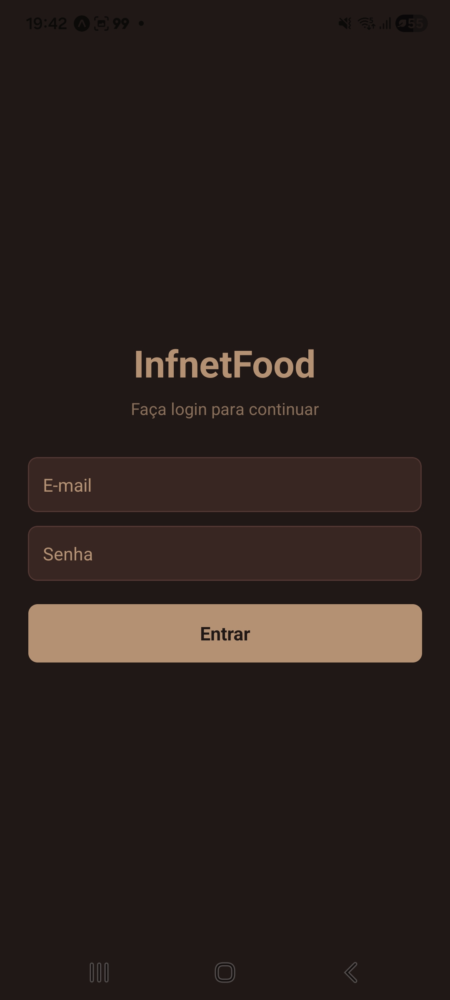
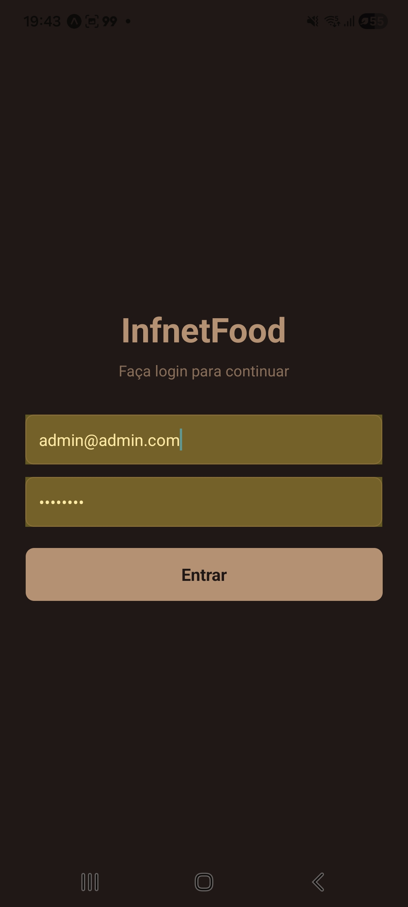
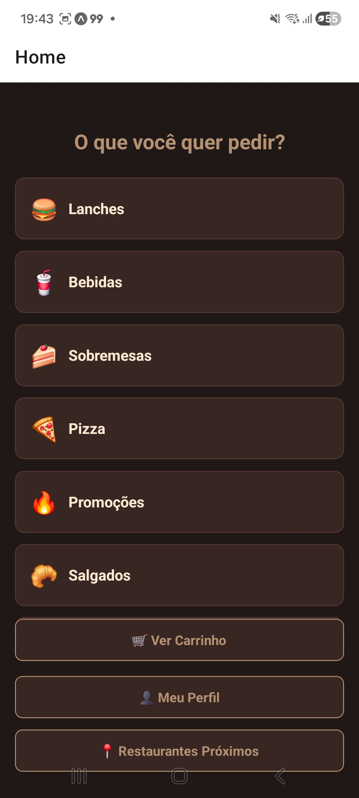
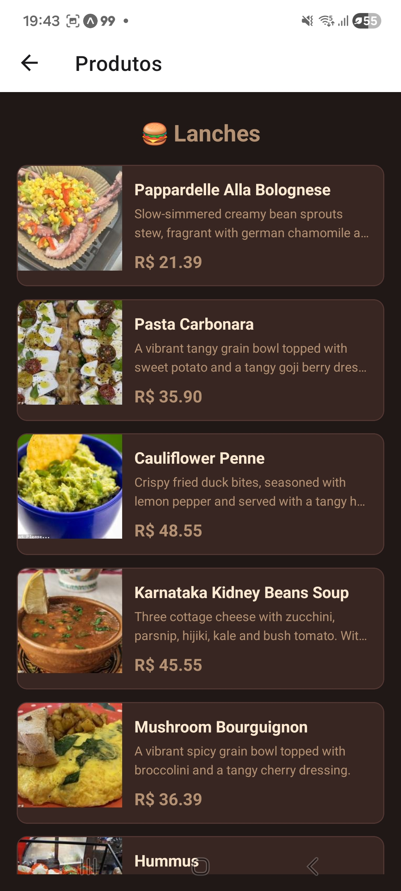
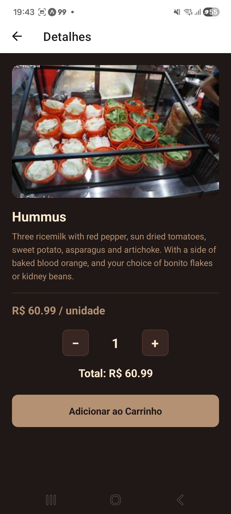
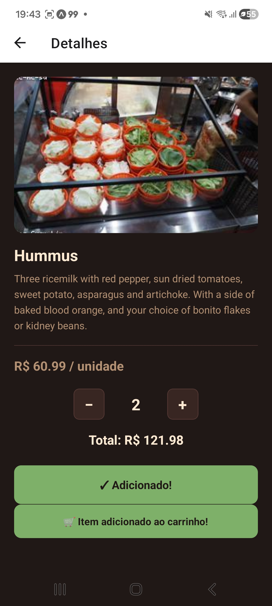
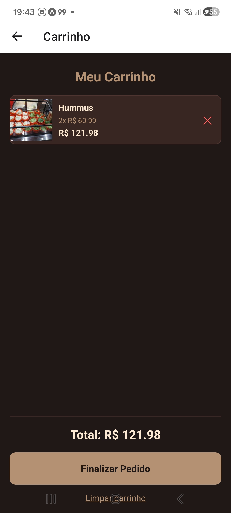
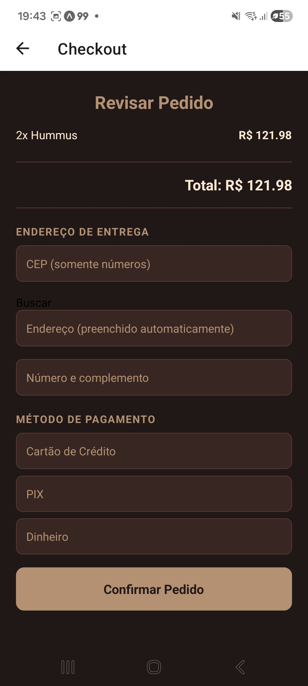
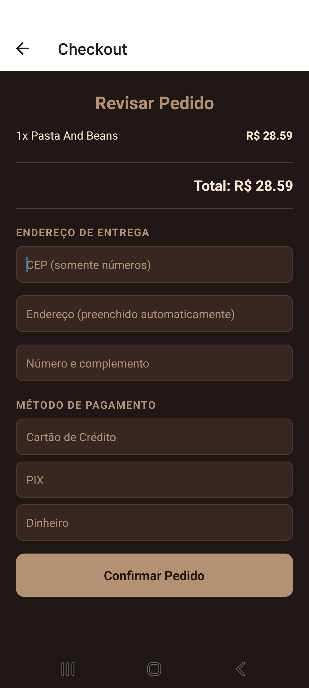
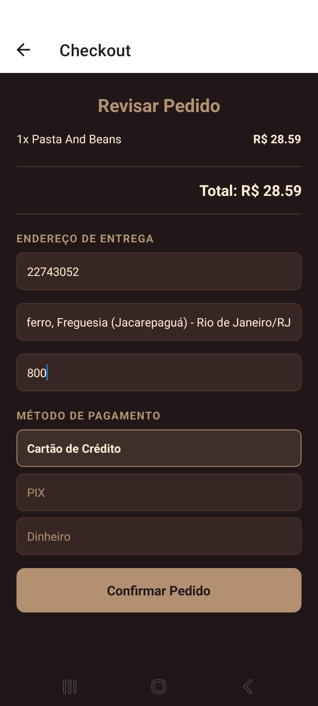
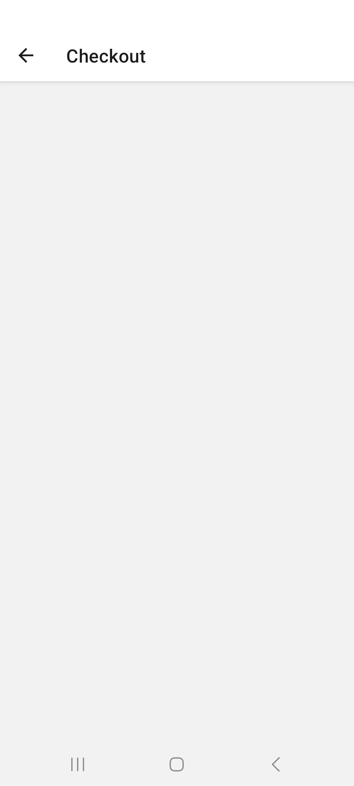
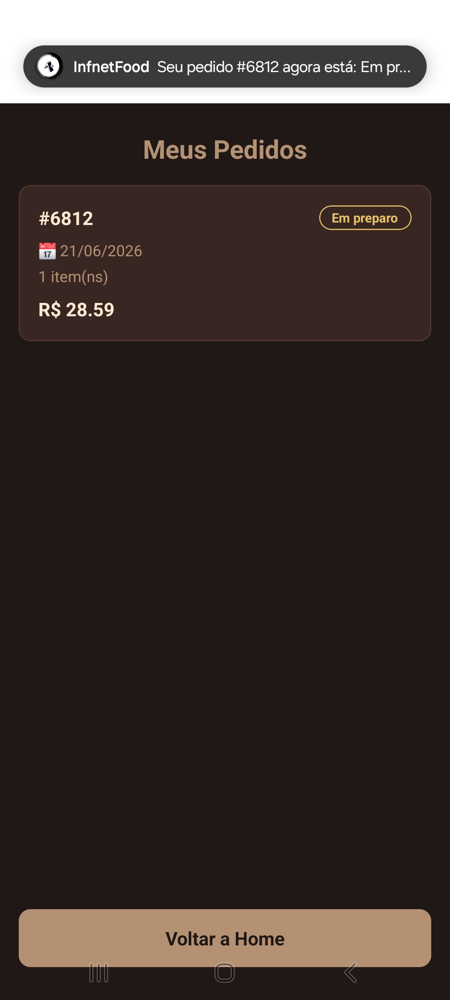
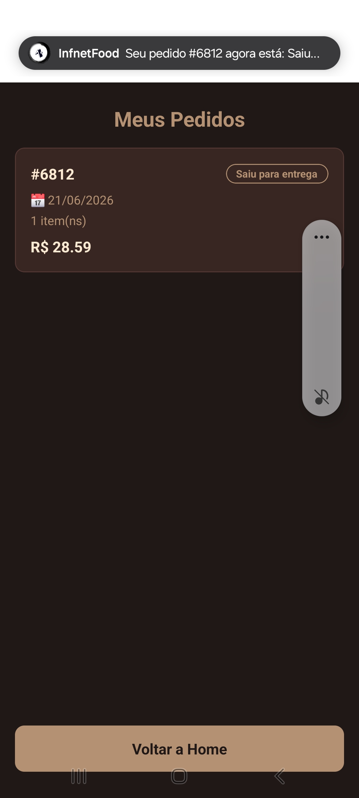
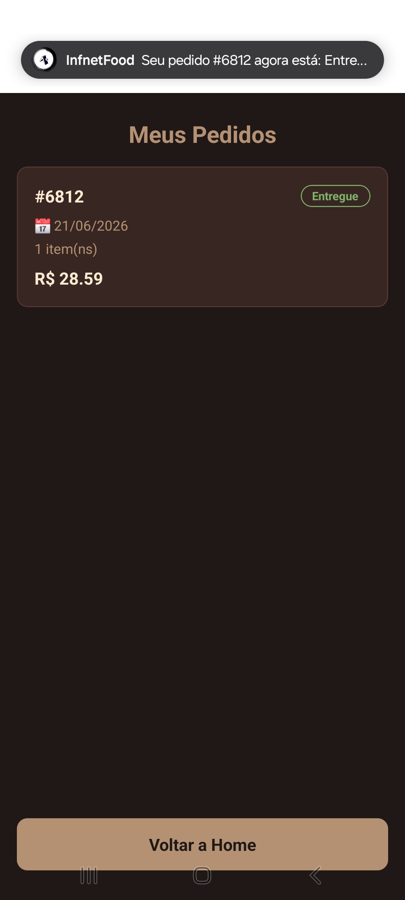
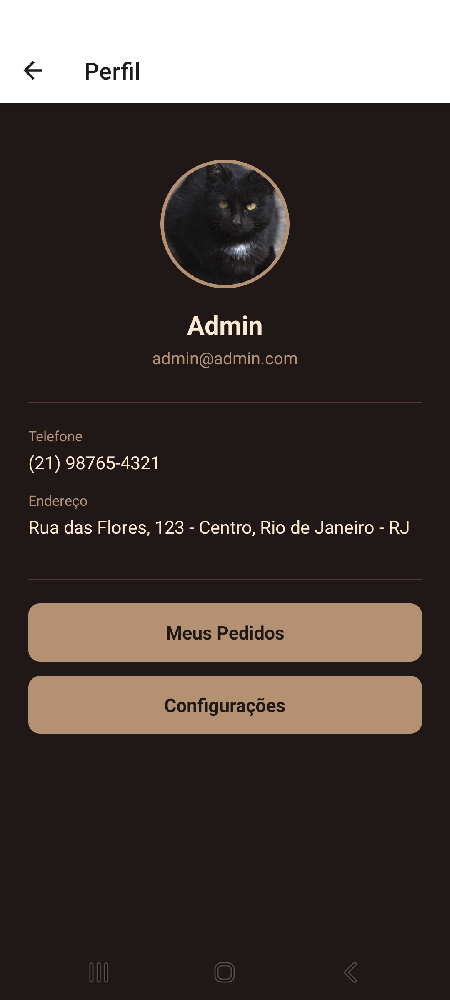
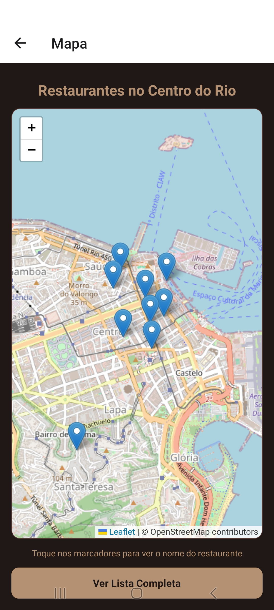
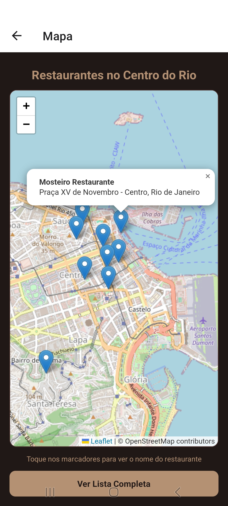
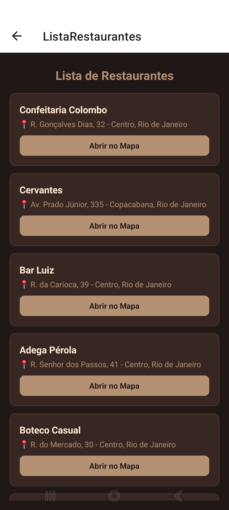
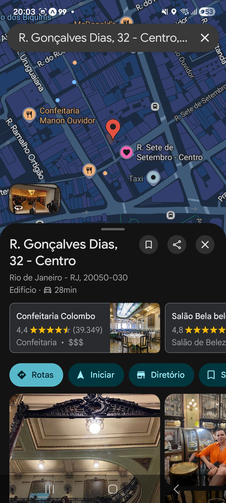
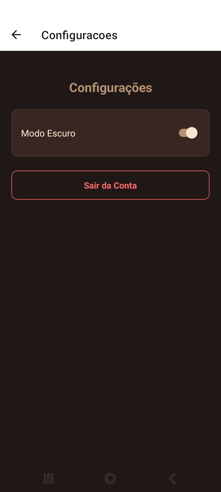
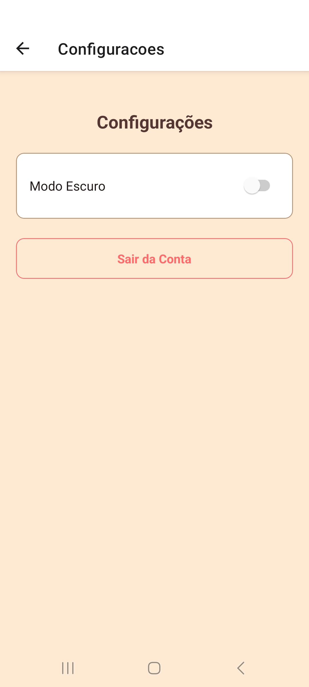
## Autor

**Mateus Sabroza Maillard**
[LinkedIn](https://www.linkedin.com/in/mateus-sabroza-b50540222) · [GitHub](https://github.com/MateusSabroza)

---
Projeto desenvolvido para a disciplina de Desenvolvimento Mobile com React Native — Instituto Infnet.